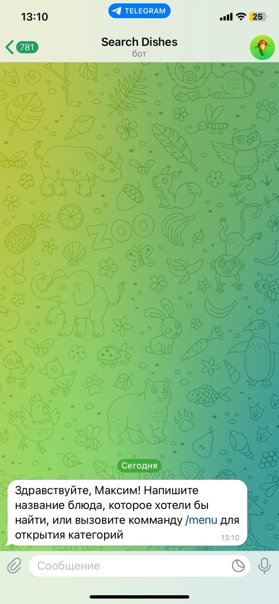
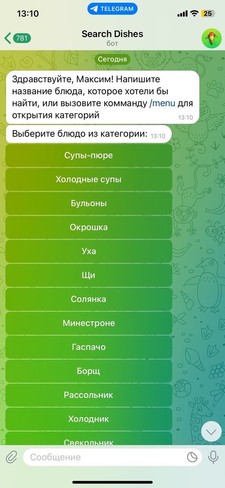
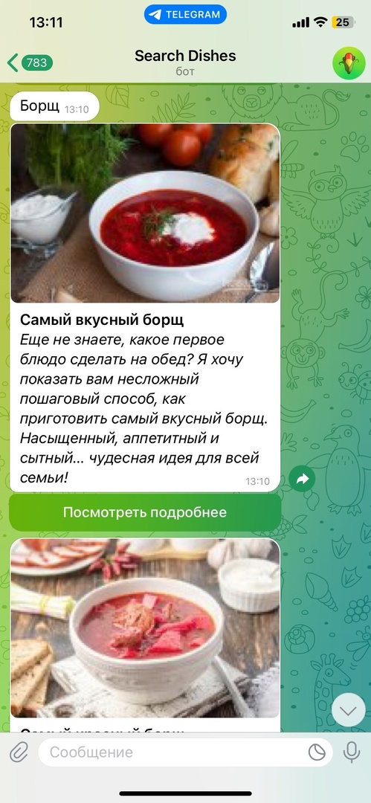
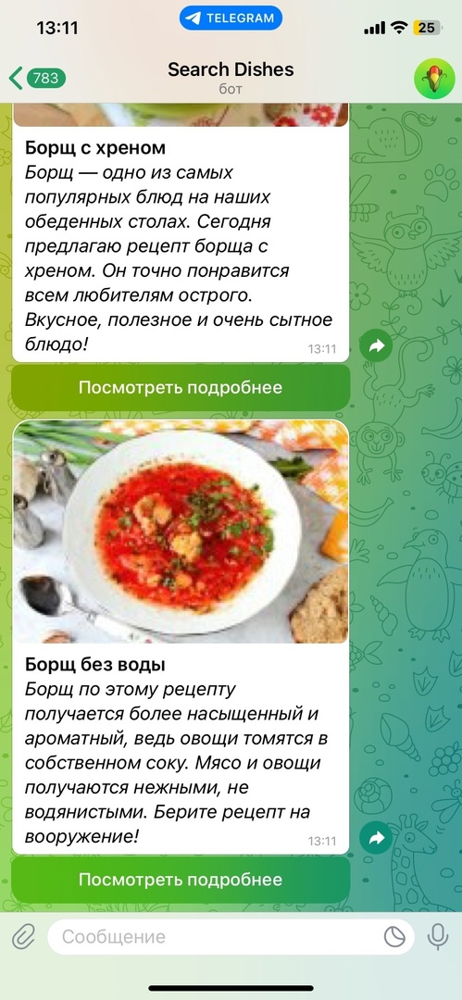
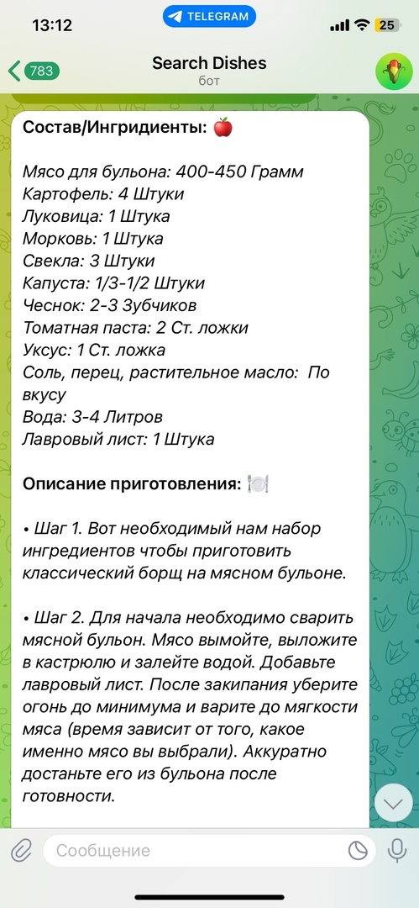

# Async telegram bot for finding recipes for dishes
Access to the bot: **@DishesSearchBot**
___
### This Telegram bot allows users to search and get recipes for dishes. The bot uses the aiogram library to interact with the Telegram API and BeautifulSoup for data parsing

## **Installation**
1. Clone the repository
```python
git clone https://github.com/MaximJrr/async_telegram_bot.git
```

2. Create a virtual environment and activate it:
```python
python3 -m venv venv
source venv/bin/activate
```

3. Install dependencies from the file **requirements.txt**:
```python
pip install -r requirements.txt
```
4. Create a **.env** file and add your Telegram token:
```python
TOKEN=your_telegram_bot_token_here
```
5. Start the bot with the command:
```python
python3 handlers.py 
```

## **Docker**
If you want to run the bot using Docker, make sure you have Docker and Docker Compose installed. Then run:

```python
docker-compose build
docker-compose up
```
or

```docker-compose up --build```

## **Using the bot**
1. Launch the bot with the /start command to start the dialog.
2. Enter the name of the dish you want to find, or call the /menu command to view the categories of dishes.
3. Choose a category of dishes from the suggested options.
4. Get a list of dishes of the selected category and select the one you are interested in.

 
 
 
